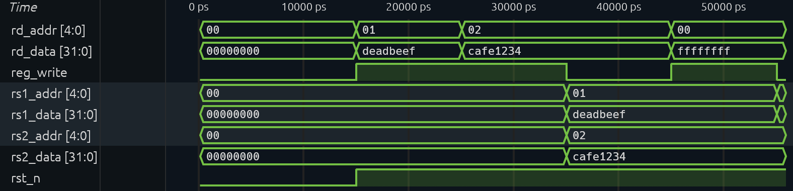
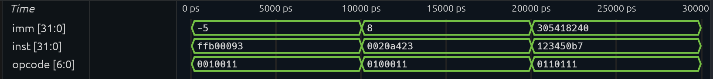
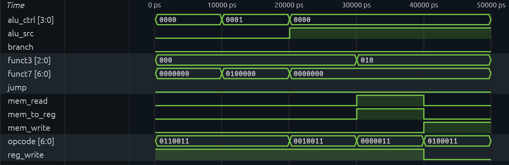
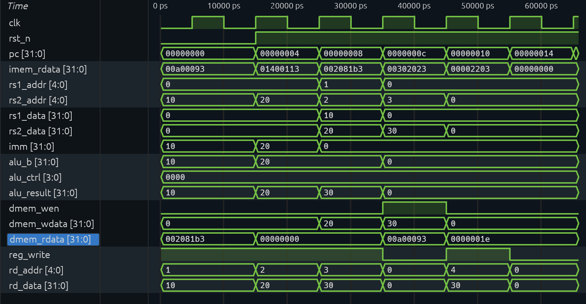

# 32-Bit Single-Cycle RISC-V Processor (RV32I)

A modular, single-cycle 32-bit RISC-V processor core designed from scratch in SystemVerilog. The core implements the base integer instruction set (RV32I), supporting arithmetic, logic, register-immediate operations, and synchronous data memory load/stores. Designed, simulated, and verified using open-source hardware tools.

---

## Architectural Overview

The processor implements a classic single-cycle datapath executing one complete instruction per clock cycle:

* **Instruction Fetch (IF):** Program Counter updates sequentially (`PC + 4`) or branches/jumps to target addresses (`PC + Immediate`).
* **Instruction Decode (ID):** Instructions are parsed into opcode, register indices, and immediate bit fields; the central Control Unit decodes control lines.
* **Execution (EX):** Arithmetic Logic Unit computes mathematical operations, signed comparisons, and effective memory addresses.
* **Memory Access (MEM):** Synchronous data memory interface for load (`lw`) and store (`sw`) instructions.
* **Writeback (WB):** Writeback multiplexer steers either memory read data or ALU computation results into the destination register (`rd`).

```text
       +-------------------------------------------------------------+
       |                                                             |
       v                                                             |
   [ Fetch ] ────► [ Decode ] ────► [ Execute ] ────► [ Memory ] ────► [ Writeback ]
   (PC -> RAM)   (Regs / Control)     (ALU)          (Load/Store)       (RD Update)
```

---

## Repository Structure

```text
riscv-core/
├── rtl/
│   ├── alu.sv              # Arithmetic Logic Unit
│   ├── regfile.sv          # 32x32 Dual-read, single-write register file
│   ├── imm_gen.sv          # Immediate sign-extension generator
│   ├── control.sv          # Instruction decoder & control unit
│   └── core.sv             # Top-level integrated processor datapath
├── sim/
│   ├── tb_alu.sv           # ALU unit verification
│   ├── tb_regfile.sv       # Register file unit verification
│   ├── tb_imm_gen.sv       # Immediate generator testbench
│   ├── tb_control.sv       # Control unit decoder testbench
│   └── tb_core.sv          # System-level testbench with RAM execution
├── sw/
│   └── program.hex         # Hex machine code executed during verification
└── docs/
    └── waveforms/          # VCD simulation waveform captures
```

---

## Verification & Waveform Analysis

All modules and the integrated processor core were verified via self-checking SystemVerilog testbenches using `iverilog` and visual analysis using `Surfer`.

---

### 1. Arithmetic Logic Unit (ALU)


The ALU supports all standard RV32I operations, signed comparisons, and equality zero-flag assertion:
* **`0 ps – 10000 ps` (ADD):** Inputs $a = 15$, $b = 27$ with `alu_ctrl = 0` $\rightarrow$ `result = 42`.
* **`10000 ps – 20000 ps` (SUB):** Inputs $a = 50$, $b = 20$ with `alu_ctrl = 1` $\rightarrow$ `result = 30`.
* **`20000 ps – 30000 ps` (Equality Zero Check):** Inputs $a = 10$, $b = 10$ with `alu_ctrl = 1` $\rightarrow$ `result = 0`, asserting `zero = 1`.
* **`30000 ps – 40000 ps` (SRA - Arithmetic Shift Right):** Inputs $a = -16$, $b = 2$ with `alu_ctrl = 7` $\rightarrow$ `result = -4` (sign bit preserved).
* **`40000 ps – 50000 ps` (SLT - Set on Less Than):** Inputs $a = -5$, $b = 3$ with `alu_ctrl = 8` $\rightarrow$ `result = 1` (signed comparison true).

---

### 2. Register File



Validates synchronous dual-read and single-write behavior across 32 general-purpose registers:
* **`0 ps – 15000 ps` (Active Reset):** `rst_n = 0` clears all internal registers to `0x00000000`.
* **`15000 ps – 35000 ps` (Synchronous Writes):** 
  * `rd_addr = 01`, `rd_data = 0xDEADBEEF`, `reg_write = 1` writes value into `x1`.
  * `rd_addr = 02`, `rd_data = 0xCAFE1234`, `reg_write = 1` writes value into `x2`.
* **`35000 ps – 50000 ps` (Simultaneous Dual Read):** `rs1_addr = 01` and `rs2_addr = 02` simultaneously read `x1` (`0xDEADBEEF`) and `x2` (`0xCAFE1234`) combinationally.
* **`50000 ps+` (Hardwired Zero Protection):** Attempting to write `0xFFFFFFFF` into `x0` (`rd_addr = 00`) is ignored, preserving `x0 == 0`.

---

### 3. Immediate Generator



Extracts and sign-extends non-contiguous instruction bit fields into standard 32-bit signed values:
* **I-Type (`opcode = 0010011`):** Decodes instruction `0xffb00093` (`addi x1, x0, -5`) $\rightarrow$ generates sign-extended `imm = -5`.
* **S-Type (`opcode = 0100011`):** Decodes instruction `0x0020a423` (`sw x2, 8(x1)`) $\rightarrow$ reconstructs split immediate bits `[31:25]` and `[11:7]` into `imm = 8`.
* **U-Type (`opcode = 0110111`):** Decodes instruction `0x123450b7` (`lui x1, 0x12345`) $\rightarrow$ generates upper 20-bit immediate `imm = 305418240` (`0x12345000`).

---

### 4. Control Unit



Decodes instruction opcode, funct3, and funct7 fields into datapath multiplexer and enable controls:
* **R-Type (`opcode = 0110011`, `funct7 = 0000000`):** Asserts `reg_write = 1`, `alu_src = 0` (register operand), `alu_ctrl = 0000` (ADD).
* **R-Type SUB (`funct7 = 0100000`):** Modifies ALU command to `alu_ctrl = 0001` (SUB).
* **I-Type Arithmetic (`opcode = 0010011`):** Asserts `alu_src = 1` (immediate operand), `reg_write = 1`.
* **Load (`opcode = 0000011`):** Asserts `mem_read = 1`, `mem_to_reg = 1` (writeback routes memory data), `alu_src = 1`.
* **Store (`opcode = 0100011`):** Asserts `mem_write = 1`, deasserts `reg_write = 0`.

---

### 5. Top-Level Core Datapath Execution



Demonstrates end-to-end execution of a five-instruction program with memory operations and register dependencies:

| Time Interval | PC | Instruction Machine Code | Disassembly | State Transition Verified |
|---|---|---|---|---|
| **15ns – 25ns** | `0x00` | `0x00a00093` | `addi x1, x0, 10` | Immediate `10` is added to `0`; writes `10` to `x1`. |
| **25ns – 35ns** | `0x04` | `0x01400113` | `addi x2, x0, 20` | Immediate `20` is added to `0`; writes `20` to `x2`. |
| **35ns – 45ns** | `0x08` | `0x002081b3` | `add x3, x1, x2`  | Reads `x1` (10) and `x2` (20); ALU computes `30`; writes `30` to `x3`. |
| **45ns – 55ns** | `0x0C` | `0x00302023` | `sw x3, 0(x0)`    | `dmem_wen = 1`; stores data `30` into RAM address `0`. |
| **55ns – 65ns** | `0x10` | `0x00002203` | `lw x4, 0(x0)`    | Memory returns `30` (`0x1E`) on `dmem_rdata`; writeback latches `30` into `x4`. |

---

## Build & Simulation Instructions

### Prerequisites
* **Compiler:** `iverilog` (Icarus Verilog v11+)
* **Simulation Runner:** `vvp`
* **Waveform Viewer:** `Surfer` or `GTKWave`

### Run Complete Core Simulation
```bash
# Compile datapath and testbench
iverilog -g2012 -s tb_core -o build/tb_core.vvp rtl/alu.sv rtl/regfile.sv rtl/imm_gen.sv rtl/control.sv rtl/core.sv sim/tb_core.sv

# Run simulation
vvp build/tb_core.vvp

# Open waveform
surfer build/core.vcd
```

---

## Future Roadmap

* Transition to a classic **5-stage pipeline** (`IF`, `ID`, `EX`, `MEM`, `WB`).
* Implement an **Operand Forwarding Unit** to eliminate ALU-to-ALU data hazard stalls.
* Implement a **Hazard Detection Unit** to handle load-use dependencies and branch target flushes.
